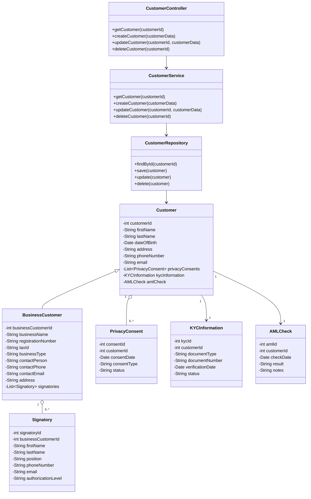
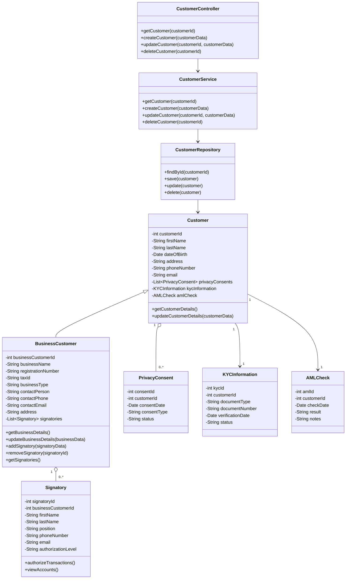
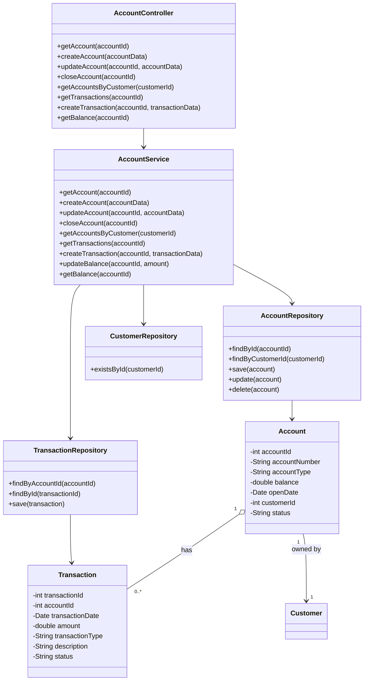
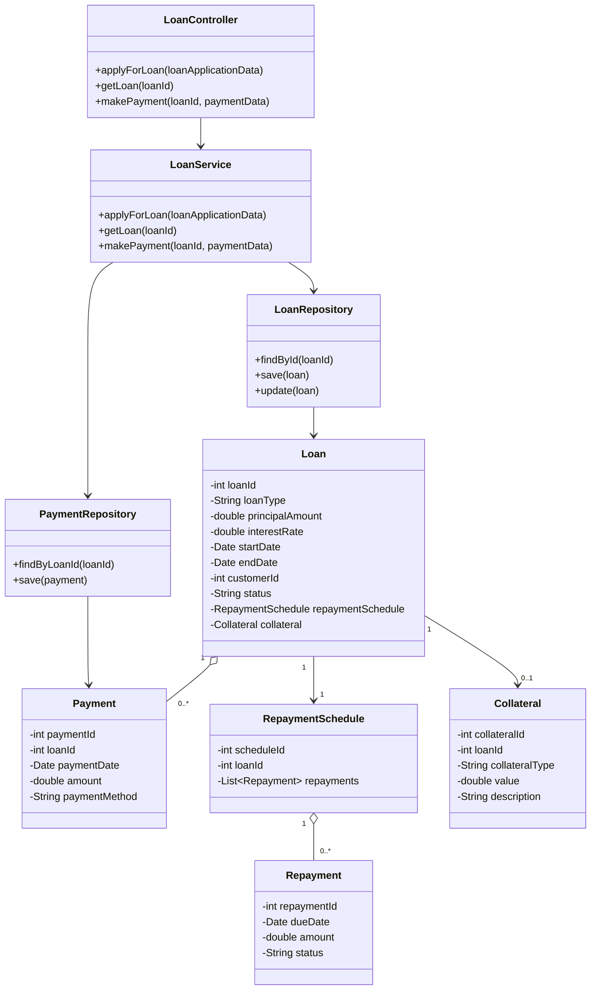
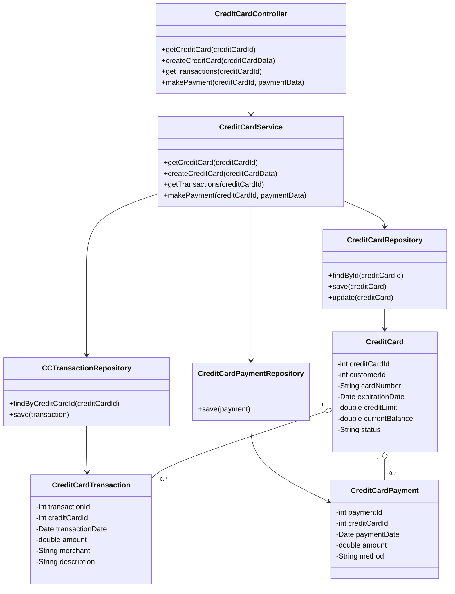
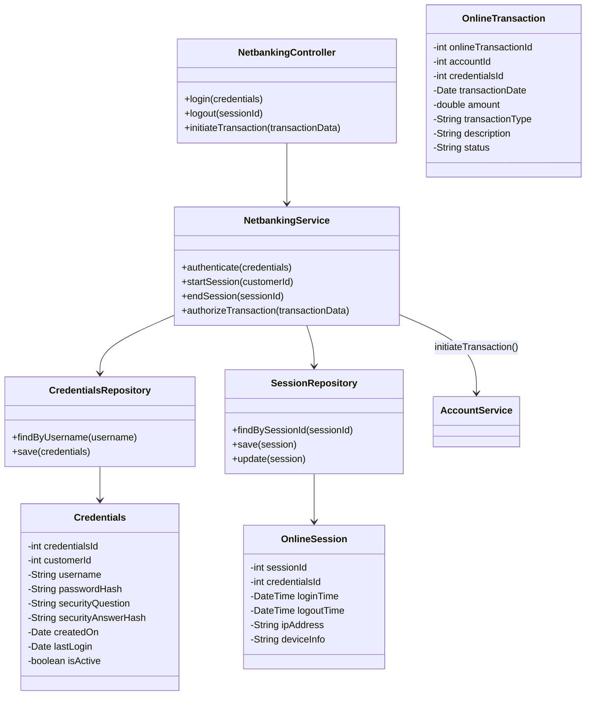
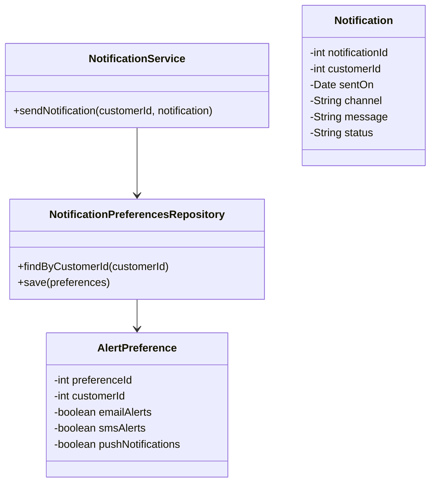
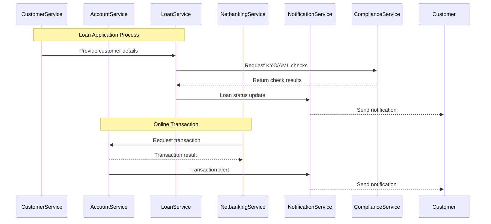

Certainly! I'll provide a low-level design (LLD) for the banking system based on the microservices architecture we discussed earlier. The LLD will delve into the internal structures of each microservice, including class diagrams, database schemas, and interaction patterns between services. We'll focus on key components, data models, APIs, and how the services integrate to fulfill the system's requirements.

---

## **Overview of the Microservices Architecture**

Before diving into each service's LLD, let's briefly recall the proposed microservices and their responsibilities:

1. **Customer Service**
2. **Account Service**
3. **Loan Service**
4. **Credit Card Service**
5. **Investment Service**
6. **Insurance Service**
7. **Netbanking Service**
8. **Notification Service**
9. **Support Service**
10. **Employee Service**
11. **Branch Service**
12. **Audit Service**
13. **Compliance Service**
14. **Third-Party Integration Service**
15. **Security Service**

---

Certainly! Let's complete the `BusinessCustomer` class in your class diagram by adding relevant attributes and methods that are specific to business customers. We can also include any additional relationships if necessary.

### **Updated Class Diagram**

### **Explanation**

#### **BusinessCustomer Class Enhancements**

- **Attributes**:

  - `int businessCustomerId`: Unique identifier for the business customer (could be the same as `customerId` if inheriting from `Customer`).
  - `String businessName`: Name of the business entity.
  - `String registrationNumber`: Official registration number of the business.
  - `String taxId`: Tax identification number.
  - `String businessType`: Type of business (e.g., LLC, Corporation, Sole Proprietorship).
  - `String contactPerson`: Main point of contact within the business.
  - `String contactPhone`: Contact person's phone number.
  - `String contactEmail`: Contact person's email address.
  - `String address`: Business address.
  - `List<Signatory> signatories`: List of authorized signatories for the business.

- **Methods** (you may consider adding these methods based on requirements):
  - `+getBusinessDetails()`: Retrieves business customer details.
  - `+updateBusinessDetails(businessData)`: Updates business customer information.
  - `+addSignatory(signatoryData)`: Adds a new signatory to the business account.
  - `+removeSignatory(signatoryId)`: Removes an existing signatory.
  - `+getSignatories()`: Retrieves a list of all signatories.

#### **Signatory Class**

- **Attributes**:

  - `int signatoryId`: Unique identifier for each signatory.
  - `int businessCustomerId`: Foreign key linking to the `BusinessCustomer`.
  - `String firstName`, `String lastName`: Personal details of the signatory.
  - `String position`: Position within the company (e.g., CEO, CFO).
  - `String phoneNumber`, `String email`: Contact information.
  - `String authorizationLevel`: Level of authorization (e.g., Full Access, View Only).

- **Relationships**:
  - A `BusinessCustomer` has a one-to-many relationship with `Signatory`, indicating that a business can have multiple authorized signatories.

#### **Inheritance and Relationships**

- The `BusinessCustomer` class **inherits** from the `Customer` class, indicating that a business customer shares common attributes and behaviors with individual customers but also has additional properties specific to businesses.

- The **composition** relationship between `BusinessCustomer` and `Signatory` (represented by the `1` o-- `0..*` notation) signifies that signatories are integral to the business customer, and they cannot exist without being associated with a business customer.

### **Updated Class Diagram with Methods**

Including methods in the `BusinessCustomer` and `Signatory` classes:

### **Additional Details**

#### **BusinessCustomer Specifics**

- **Registration Details**: Businesses often have a registration number and tax ID that are required for regulatory and compliance purposes. Including these ensures that the bank can maintain proper records for legal entities.

- **Contact Information**: The primary contact person and their contact information are crucial for communication. This may be different from individual customers who interact directly.

- **Business Type**: Differentiates between various legal structures, which may affect services offered and compliance requirements.

#### **Signatories**

- **Authorization Levels**: Allows the system to manage what actions each signatory can perform on behalf of the business, such as making transactions, viewing statements, or managing accounts.

- **Association with BusinessCustomer**: Each signatory is linked to a specific business customer, and their permissions are governed by this relationship.

### **How This Fits into the Overall System**

- **Customer Controller and Service**: The controller and service layers would include methods to handle business customer-specific actions, such as adding signatories or updating business details.

- **Repositories**:

  - **CustomerRepository**: May handle basic CRUD operations for both individual and business customers.

  - **BusinessCustomerRepository**: (Optional) A specialized repository to handle complex queries or operations specific to business customers and their signatories.

- **Integration with Other Services**:

  - **Account Service**: Business customers may have different account types (e.g., corporate accounts), and the Account Service should accommodate these.

  - **Loan Service**: Business customers might apply for business loans, requiring different processing.

  - **Netbanking Service**: Signatories need to access online banking on behalf of the business, so their credentials and permissions must be managed accordingly.

### **Example Usage**

- **Creating a Business Customer**:

  - The `CustomerController` receives a request to create a new business customer.

  - It calls `CustomerService.createCustomer(businessCustomerData)`, where `businessCustomerData` includes business-specific information.

  - The `CustomerService` determines that the data represents a `BusinessCustomer` and processes it accordingly.

- **Adding a Signatory**:

  - Through the `BusinessCustomer` methods, an authorized user can add a new signatory.

  - The system collects necessary information and creates a new `Signatory` associated with the `BusinessCustomer`.

### **Considerations**

- **Data Validation**: Ensure that all mandatory fields, such as `businessName` and `registrationNumber`, are validated during input.

- **Security and Permissions**:

  - Only authorized personnel should be able to modify business customer details.

  - Signatory actions should be logged for auditing purposes.

- **Compliance**:

  - Business customers may require different KYC/AML checks compared to individual customers.

  - Tax reporting and regulatory compliance may necessitate additional data fields and processes.

### **Conclusion**

Completing the `BusinessCustomer` class enriches the model to accurately represent business entities within your banking system. It accounts for the unique attributes and behaviors of business customers and how they interact with the system, especially concerning authorized signatories who act on behalf of the business.

By extending the `Customer` class, `BusinessCustomer` inherits common characteristics while adding business-specific properties. This design promotes code reuse and logical organization within the system.

Certainly! I'll provide a complete class diagram for the **Account Service** using Mermaid syntax, similar to how you have provided the class diagram for the **Netbanking Service**. This diagram will include the main classes, their attributes, methods, and the relationships between them. Additionally, I'll explain each component of the diagram for clarity.

---

### **Account Service Class Diagram**

---

### **Explanation**

#### **Controllers**

- **AccountController**: The entry point for handling HTTP requests related to accounts. It exposes APIs for:

  - Retrieving account details.
  - Creating new accounts.
  - Updating existing accounts.
  - Closing accounts.
  - Fetching accounts by customer ID.
  - Retrieving transactions for an account.
  - Creating new transactions.
  - Checking account balance.

#### **Services**

- **AccountService**: Contains business logic related to account operations. It performs:

  - Validation of incoming data.
  - Interactions with repositories.
  - Business rules enforcement (e.g., balance updates, account status checks).

#### **Repositories**

- **AccountRepository**: Interface for CRUD operations on `Account` entities in the database.

- **TransactionRepository**: Interface for CRUD operations on `Transaction` entities.

- **CustomerRepository**: Used to verify the existence of a customer. This is important when creating or updating accounts to ensure the associated customer exists.

#### **Models**

- **Account**: Represents a bank account with attributes:

  - `accountId`: Unique identifier for the account (primary key).
  - `accountNumber`: The official account number assigned.
  - `accountType`: Type of account (e.g., Savings, Checking).
  - `balance`: Current balance.
  - `openDate`: The date the account was opened.
  - `customerId`: Identifier of the customer who owns the account.
  - `status`: Current status (e.g., Active, Closed).

- **Transaction**: Represents a financial transaction with attributes:

  - `transactionId`: Unique identifier for the transaction (primary key).
  - `accountId`: Identifier of the account involved.
  - `transactionDate`: Date and time when the transaction occurred.
  - `amount`: Amount of the transaction.
  - `transactionType`: Type (e.g., Deposit, Withdrawal, Transfer).
  - `description`: A description or note about the transaction.
  - `status`: Status of the transaction (e.g., Pending, Completed).

#### **Relationships**

- **AccountController** depends on **AccountService**.

- **AccountService** interacts with **AccountRepository**, **TransactionRepository**, and **CustomerRepository**.

- **AccountRepository** manages **Account** entities.

- **TransactionRepository** manages **Transaction** entities.

- An **Account** has a one-to-many relationship with **Transaction** (an account can have multiple transactions).

- An **Account** is associated with a **Customer** (the owner of the account).

---

### **Detailed Class Definitions**

#### **AccountController**

Handles HTTP requests and maps them to service calls.

- **Methods**:

  - `+getAccount(accountId)`: Retrieves account details by ID.
  - `+createAccount(accountData)`: Creates a new account with provided data.
  - `+updateAccount(accountId, accountData)`: Updates account information.
  - `+closeAccount(accountId)`: Closes the specified account.
  - `+getAccountsByCustomer(customerId)`: Retrieves all accounts owned by a customer.
  - `+getTransactions(accountId)`: Retrieves transactions for an account.
  - `+createTransaction(accountId, transactionData)`: Initiates a new transaction.
  - `+getBalance(accountId)`: Retrieves the current balance of the account.

#### **AccountService**

Implements the business logic for account operations.

- **Methods**:

  - `+getAccount(accountId)`: Retrieves account details.
  - `+createAccount(accountData)`: Validates and creates a new account.
  - `+updateAccount(accountId, accountData)`: Validates and updates account information.
  - `+closeAccount(accountId)`: Validates and changes account status to closed.
  - `+getAccountsByCustomer(customerId)`: Retrieves accounts for a customer.
  - `+getTransactions(accountId)`: Retrieves transaction history.
  - `+createTransaction(accountId, transactionData)`: Processes a transaction, updates balance.
  - `+updateBalance(accountId, amount)`: Updates the account balance.
  - `+getBalance(accountId)`: Retrieves the balance.

#### **AccountRepository**

Data access layer for accounts.

- **Methods**:

  - `+findById(accountId)`: Finds an account by ID.
  - `+findByCustomerId(customerId)`: Retrieves accounts by customer ID.
  - `+save(account)`: Saves a new account.
  - `+update(account)`: Updates an existing account.
  - `+delete(account)`: Deletes (or deactivates) an account.

#### **TransactionRepository**

Data access layer for transactions.

- **Methods**:

  - `+findByAccountId(accountId)`: Retrieves transactions for a given account.
  - `+findById(transactionId)`: Finds a transaction by ID.
  - `+save(transaction)`: Saves a new transaction.

#### **CustomerRepository**

Used to verify customer existence.

- **Methods**:

  - `+existsById(customerId)`: Checks if a customer exists.

#### **Account**

Data model representing an account.

- **Attributes**:

  - `-int accountId`
  - `-String accountNumber`
  - `-String accountType`
  - `-double balance`
  - `-Date openDate`
  - `-int customerId`
  - `-String status`

#### **Transaction**

Data model representing a transaction.

- **Attributes**:

  - `-int transactionId`
  - `-int accountId`
  - `-Date transactionDate`
  - `-double amount`
  - `-String transactionType`
  - `-String description`
  - `-String status`

---

### **Inter-Service Communication**

- **Customer Service**:

  - **AccountService** uses **CustomerRepository** or calls **CustomerService** APIs to validate that the `customerId` associated with an account exists and is valid.

- **Notification Service**:

  - Upon significant events (e.g., account creation, balance changes, large transactions), **AccountService** publishes messages to a message broker (e.g., Kafka, RabbitMQ).
  - **NotificationService** subscribes to these messages to send notifications to customers.

- **Netbanking Service**:

  - **AccountService** exposes APIs that **NetbankingService** consumes to retrieve account details and perform transactions.

---

### **Example Sequence Flow**

#### **Creating a New Account**

1. **AccountController.createAccount(accountData)**:

   - Receives a request to create a new account.

2. **AccountService.createAccount(accountData)**:

   - Validates the `accountData`.
   - Calls **CustomerRepository.existsById(customerId)** to ensure the customer exists.
   - Generates a new `accountNumber`.
   - Initializes the `balance` to zero.
   - Sets the `status` to "Active".

3. **AccountRepository.save(account)**:

   - Persists the new account in the database.

4. **Publish Event**:

   - **AccountService** publishes an `AccountCreated` event to the message broker.

---

#### **Processing a Transaction**

1. **AccountController.createTransaction(accountId, transactionData)**:

   - Receives a request to create a new transaction for the specified account.

2. **AccountService.createTransaction(accountId, transactionData)**:

   - Validates the `transactionData`.
   - Checks the `status` of the account to ensure it's active.
   - For withdrawal transactions, verifies sufficient balance.
   - Creates a new `Transaction` object.
   - Updates the account balance using **updateBalance(accountId, amount)**.

3. **TransactionRepository.save(transaction)**:

   - Saves the transaction record in the database.

4. **AccountRepository.update(account)**:

   - Updates the account balance.

5. **Publish Event**:

   - **AccountService** publishes a `TransactionCreated` event to the message broker.

---

### **Data Validation and Error Handling**

- **Validation**:

  - Ensure that all mandatory fields are present.
  - Validate data formats (e.g., date formats, numeric values).
  - Business rules validation (e.g., minimum balance requirements).

- **Error Handling**:

  - Use appropriate HTTP status codes (e.g., 400 Bad Request, 404 Not Found, 500 Internal Server Error).
  - Return meaningful error messages to the client.
  - Log errors using a centralized logging system.

---

### **Security Considerations**

- **Authentication and Authorization**:

  - Verify that the requesting user is authenticated.
  - Ensure that the user has permission to access or modify the account.

- **Input Sanitization**:

  - Sanitize input data to prevent injection attacks.

- **Data Privacy**:

  - Mask sensitive data (e.g., account numbers) where appropriate.

---

### **Scalability and Performance**

- **Caching**:

  - Implement caching for frequently accessed data that doesn't change often, such as account details.

- **Pagination**:

  - Use pagination for endpoints that return lists (e.g., transactions) to handle large datasets.

- **Asynchronous Processing**:

  - For operations that can be processed asynchronously (e.g., generating statements), use messaging queues.

---

### **Technology Stack**

- **Programming Language**: Choose a language compatible with the overall system (e.g., Java, C#, Python).

- **Frameworks**:

  - **Spring Boot** (Java)
  - **ASP.NET Core** (C#)

- **Database**:

  - Use a relational database like PostgreSQL or MySQL for transactional consistency.

---

### **API Endpoints**

- `GET /accounts/{accountId}`: Retrieve account information.

- `POST /accounts`: Create a new account.

- `PUT /accounts/{accountId}`: Update account information.

- `DELETE /accounts/{accountId}`: Close an account.

- `GET /customers/{customerId}/accounts`: Get all accounts for a customer.

- `GET /accounts/{accountId}/transactions`: Retrieve transactions for an account.

- `POST /accounts/{accountId}/transactions`: Create a new transaction.

- `GET /accounts/{accountId}/balance`: Get the balance of an account.

---

### **Integration with Other Services**

- **Consuming Customer Service APIs**:

  - To retrieve or validate customer information when needed.

- **Publishing Events**:

  - Publish events like `AccountCreated` or `TransactionProcessed` for other services (e.g., Notification Service) to consume.

---

### **Monitoring and Logging**

- **Metrics**:

  - Track key performance indicators (e.g., number of accounts created, transaction volumes).

- **Health Checks**:

  - Implement health endpoints (e.g., `/health`) for monitoring service availability.

- **Logging**:

  - Log important actions, errors, and exceptions in a centralized logging system.

---

### **Testing**

- **Unit Tests**:

  - Test individual methods in controllers, services, and repositories.

- **Integration Tests**:

  - Test interactions with the database and other services.

- **API Tests**:

  - Validate API endpoints using tools like Postman or automated test suites.

- **Performance Tests**:

  - Ensure the service can handle the expected load.

---

### **Conclusion**

This detailed class diagram and explanation of the **Account Service** should provide a comprehensive understanding of how the service is structured, how it operates, and how it interacts with other components in the system. It encapsulates the core functionality required to manage bank accounts and transactions within the banking system.

---

## **3. Loan Service**

**Responsibilities**:

- Manage loan applications and processing.
- Handle loan payments and repayment schedules.

### **Class Diagram**

### **Database Schema**

**Tables**:

- `Loan`
- `Payment`
- `RepaymentSchedule`
- `Repayment`
- `Collateral`

### **API Endpoints**

- `POST /loans`
- `GET /loans/{loanId}`
- `POST /loans/{loanId}/payments`

### **Inter-Service Communication**

- Interacts with Customer Service to verify customer details.
- Uses Compliance Service for KYC/AML checks.
- Notifies Notification Service for loan status updates.

---

## **4. Credit Card Service**

**Responsibilities**:

- Manage credit cards.
- Handle credit card transactions and payments.

### **Class Diagram**

### **Database Schema**

**Tables**:

- `CreditCard`
- `CreditCardTransaction`
- `CreditCardPayment`

### **API Endpoints**

- `GET /credit-cards/{creditCardId}`
- `POST /credit-cards`
- `GET /credit-cards/{creditCardId}/transactions`
- `POST /credit-cards/{creditCardId}/payments`

### **Inter-Service Communication**

- Retrieves customer info from Customer Service.
- Notifies Notification Service for statements, payment reminders.

---

## **5. Netbanking Service**

**Responsibilities**:

- Handle user authentication and authorization.
- Manage online sessions.
- Process online transactions.

### **Class Diagram**

### **Database Schema**

**Tables**:

- `Credentials`
- `OnlineSession`

### **API Endpoints**

- `POST /netbanking/login`
- `POST /netbanking/logout`
- `POST /netbanking/transactions`

### **Inter-Service Communication**

- Uses Customer Service for customer validation during registration.
- Communicates with Account Service to process transactions.
- Notifies Notification Service upon certain events (e.g., login from new device).

---

## **6. Notification Service**

**Responsibilities**:

- Send notifications and alerts.
- Manage customer alert preferences.

### **Class Diagram**

### **Database Schema**

**Tables**:

- `Notification`
- `AlertPreference`

### **Interaction with Other Services**

- Listens to events from other services via message broker.
- Sends notifications based on alert preferences.

---

## **Inter-Service Communication Diagram**

---

## **Data Flow Example: Online Transaction**

1. **Customer Initiates Transaction**:

   - Customer uses netbanking application to initiate a fund transfer.
   - **NetbankingService** authenticates the customer using credentials and active session.

2. **Authorization and Fraud Check**:

   - **NetbankingService** validates transaction limits and preferences.
   - May communicate with **SecurityService** for fraud detection.

3. **Transaction Processing**:

   - **NetbankingService** calls **AccountService** API to debit the customer's account.
   - **AccountService** validates sufficient balance and account status.
   - Transaction is recorded in **Transaction** table.

4. **Notification**:
   - **AccountService** publishes a transaction event to the message broker.
   - **NotificationService** consumes the event and sends an alert to the customer.

---

## **Security Considerations**

- **Authentication and Authorization**:
  - **NetbankingService** handles customer authentication.
  - Uses tokens (e.g., JWT) for session management.
- **Encryption**:

  - Sensitive data like passwords are stored hashed using algorithms like bcrypt.
  - Communication between services secured using TLS.

- **Audit Logging**:
  - All critical operations are logged in **AuditService**.
  - Logs include actor, action, timestamp, and details.

---

## **Error Handling and Resilience**

- **Circuit Breakers**:
  - Implemented in service calls to prevent cascading failures.
- **Retries and Timeouts**:

  - Service calls have retry mechanisms with exponential backoff.
  - Timeouts are set to avoid hanging calls.

- **Idempotency Tokens**:
  - For operations like transaction initiation to prevent duplicate processing.

---

## **Technology Stack**

- **Programming Language**: Java, Spring Boot (or your preferred language/framework).
- **Databases**:
  - Relational DBs (e.g., PostgreSQL) for transactional data.
  - NoSQL DBs (e.g., MongoDB) for flexible data storage (if needed).
- **Message Broker**: RabbitMQ or Apache Kafka for event-driven communication.
- **API Gateway**: For routing client requests to appropriate services.
- **Service Registry**: Eureka or Consul for service discovery.
- **Configuration Management**: Use centralized config service.

---

## **Deployment and DevOps**

- **Containerization**: Docker containers for each microservice.
- **Orchestration**: Kubernetes for managing container deployment.
- **CI/CD Pipeline**: Jenkins, GitLab CI/CD, or similar tools for continuous integration and deployment.
- **Monitoring and Logging**:
  - Use Prometheus and Grafana for monitoring.
  - ELK stack (Elasticsearch, Logstash, Kibana) for logging.

---

## **Further Considerations**

- **Data Consistency**:

  - Use eventual consistency where immediate consistency is not critical.
  - Implement distributed transactions with Saga pattern if necessary.

- **Scaling**:

  - Stateless services to be horizontally scalable.
  - Services handling heavy loads (e.g., NetbankingService) should be designed to scale out.

- **API Documentation**:

  - Use Swagger/OpenAPI for documenting RESTful APIs.

- **Testing**:
  - Unit tests, integration tests, and contract tests for services.
  - End-to-end testing for workflows involving multiple services.

---

## **Conclusion**

The low-level design presented provides a detailed blueprint for implementing the microservices in the banking system. Each service has its own database schemas, class structures, and API definitions, ensuring clear boundaries and responsibilities. Inter-service communication is carefully planned using RESTful APIs and asynchronous messaging, promoting a decoupled and scalable architecture.

By following this LLD, developers can proceed to implement each microservice, ensuring consistency with the overall system design and facilitating smooth integration between services. Additionally, the design addresses critical aspects such as security, data consistency, error handling, and scalability, which are essential for a robust banking application.

---

**Feel free to ask if you need further details on specific components or aspects of the design!**
